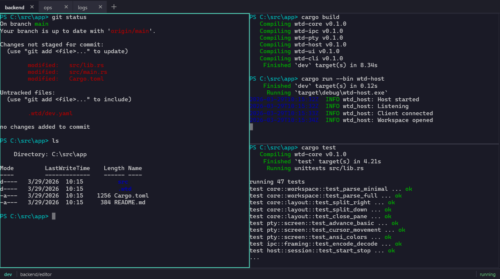
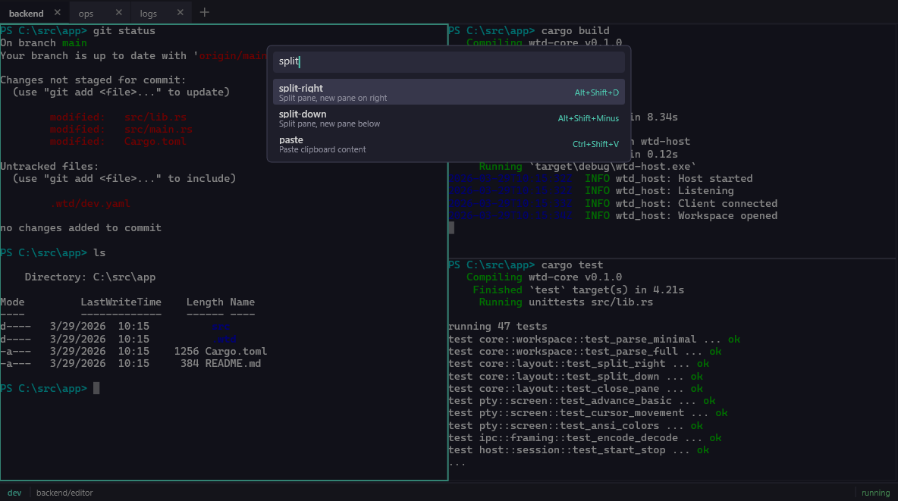
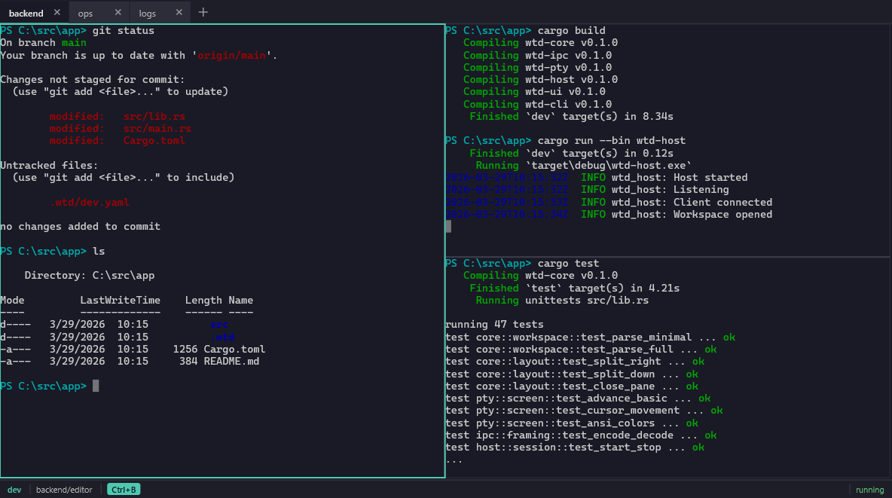
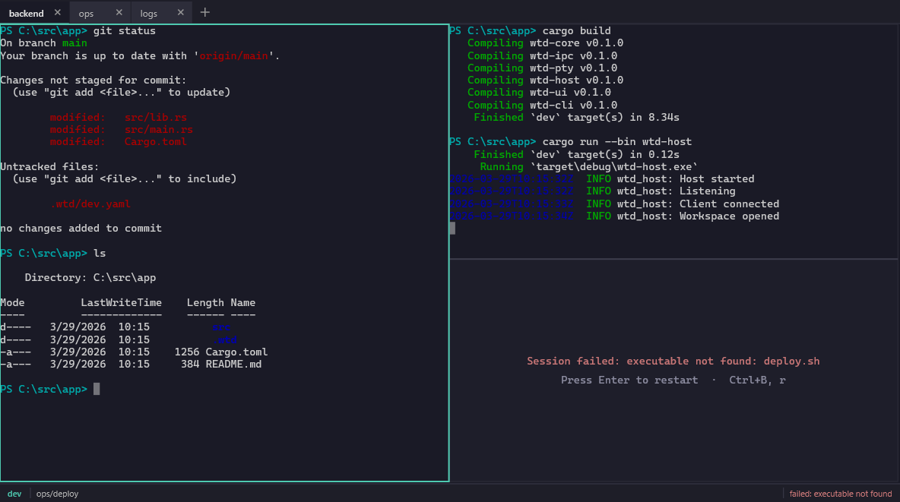

# WinTermDriver

A Windows-native terminal workspace manager for defining, launching, viewing, and controlling collections of console sessions arranged into windows, tabs, and panes.

WinTermDriver combines three ideas:

1. A real terminal UI with tabs and split panes that feel close to Windows Terminal.
2. A persistent workspace model that can save and recreate named layouts and session launch definitions.
3. A controller plane that can drive any pane or session programmatically without breaking ordinary interactive use.


*A workspace with three tabs and split panes showing git status, build output, and test results.*

### Command palette

Press `Ctrl+Shift+Space` to open the command palette. Fuzzy search filters the full action catalog in real time:



### Prefix chord shortcuts

Tmux-style prefix chords (`Ctrl+B` followed by a key) provide quick split, focus, and tab management. The status bar shows when the prefix is active:



### Error display

When a session fails to launch or exits unexpectedly, the pane shows a clear error message with restart instructions:



## Quickstart

### 1. Install

**From GitHub Releases (recommended):**

Download the latest `wtd-<version>-windows-x86_64.zip` from [Releases](https://github.com/govert/WinTermDriver/releases). Extract the archive and add the directory containing the three binaries to your `PATH`:

```
wtd-<version>-windows-x86_64/
  wtd.exe          CLI controller
  wtd-host.exe     Background host process
  wtd-ui.exe       Graphical UI
```

Verify installation:

```
wtd --version
```

**From source:**

Requires [Rust](https://rustup.rs/) stable toolchain with the MSVC target (the included `rust-toolchain.toml` pins this automatically):

```bash
git clone https://github.com/govert/WinTermDriver.git
cd WinTermDriver
cargo build --release
```

Binaries are in `target/release/`. Add that directory to your `PATH`, or copy the three `.exe` files to a location already on your `PATH`.

### 2. Create a workspace definition

Create a `.wtd/` directory in your project and add a YAML file:

```bash
mkdir .wtd
```

Save the following as `.wtd/dev.yaml`:

```yaml
version: 1
name: dev
tabs:
  - name: main
    layout:
      type: split
      orientation: horizontal
      ratio: 0.5
      children:
        - type: pane
          name: editor
          session:
            profile: powershell
        - type: pane
          name: server
          session:
            profile: powershell
            startupCommand: echo "Server pane ready"
    focus: editor
```

### 3. Open the workspace

```bash
wtd up dev
```

The host process auto-starts in the background on first use. Two ConPTY sessions launch — one in each pane, and the UI opens attached to the workspace.

### 4. Interact via CLI

```bash
# Low-level text injection
wtd send dev/server "Get-Process | Select-Object -First 5"

# Configure an agent-style pane once
wtd configure-pane dev/server --driver-profile claude-code

# Send a pane-aware prompt
wtd prompt dev/server "Summarize the current repo status"

# Read back what's on screen
wtd capture dev/server

# Read back a replayable VT snapshot of the visible screen
wtd capture dev/server --vt

# List all panes
wtd list panes dev

# Inspect pane metadata
wtd inspect dev/editor

# Close the workspace
wtd close dev --kill
```

### 5. Lower-level startup (optional)

```bash
wtd open dev
wtd-ui --workspace dev
```

Use this split flow when you want to open the workspace headlessly first and attach the UI separately. `wtd up dev` is equivalent to these two commands together.

## Diagnostics

For resize, repaint, and mouse-capture investigations on the Windows host path,
run the built-in crossterm probe:

```powershell
pwsh .\tools\Run-WtdCrosstermProbe.ps1 -AutoResize
```

This launches a deterministic terminal surface inside `wtd`, attaches
`wtd-ui`, captures the visible buffer after startup and after scripted window
resizes, and writes logs under `logs\wtd-crossterm-probe\...`.

## Workspace YAML

Workspace definitions live in `.wtd/<name>.yaml` (project-local) or `%APPDATA%\WinTermDriver\workspaces\<name>.yaml` (user-global). Project-local files take priority.

### Minimal example

```yaml
version: 1
name: quick
tabs:
  - name: main
    layout:
      type: pane
      name: shell
```

Uses the default profile (PowerShell) with no custom settings.

### Full example with profiles

```yaml
version: 1
name: dev
description: Development workspace

defaults:
  profile: pwsh
  restartPolicy: on-failure
  scrollbackLines: 20000
  driver:
    profile: claude-code

profiles:
  pwsh:
    type: powershell
    executable: pwsh.exe
    title: "{name} — PowerShell"
  ubuntu:
    type: wsl
    distribution: Ubuntu-24.04
  prodssh:
    type: ssh
    host: prod-box
    user: deploy
    port: 22
    identityFile: "%USERPROFILE%\\.ssh\\prod_key"

bindings:
  prefix: Ctrl+B
  prefixTimeout: 2000
  chords:
    "%": split-right
    "\"": split-down
    o: focus-next-pane
    c: new-tab
    x: close-pane
  keys:
    Ctrl+Shift+T: new-tab

tabs:
  - name: backend
    layout:
      type: split
      orientation: horizontal
      ratio: 0.5
      children:
        - type: pane
          name: editor
          session:
            profile: pwsh
            cwd: "C:\\src\\app"
        - type: split
          orientation: vertical
          ratio: 0.6
          children:
            - type: pane
              name: server
              session:
                profile: pwsh
                cwd: "C:\\src\\app"
                startupCommand: dotnet watch run
            - type: pane
              name: tests
              session:
                profile: pwsh
                cwd: "C:\\src\\app"
    focus: editor

  - name: ops
    layout:
      type: split
      orientation: vertical
      children:
        - type: pane
          name: prod-shell
          session:
            profile: prodssh
        - type: pane
          name: prod-logs
          session:
            profile: prodssh
            startupCommand: journalctl -f -u myservice
```

### Built-in profile types

| Type | Description |
|------|-------------|
| `powershell` | Windows PowerShell (`powershell.exe`); falls back to `pwsh.exe` if available |
| `cmd` | Command Prompt |
| `wsl` | WSL distribution (set `distribution` to target a specific distro) |
| `ssh` | Remote SSH session (set `host`, `user`, optionally `port`, `identityFile`) |
| `custom` | Arbitrary executable (requires `executable` field) |

### Prompt driver profiles

`wtd prompt` uses pane-local driver settings to prepare the composer, expand multiline input, and submit safely. This is the reliable path for driving agent CLIs with different input behaviors.

For coding agents, the intended pattern is:

1. `wtd prompt <pane> "<prompt text>"` whenever you want to write
2. `wtd capture <pane>` whenever you want to read the current screen
3. `wtd configure-pane <pane> ...` only when you want to override the inferred driver

Keep `wtd send` for low-level text injection and shell commands, not agent prompting.

Built-in profiles:

| Profile | Submit key | Multiline strategy | Notes |
|---------|------------|--------------------|-------|
| `plain` | `Enter` | rejected | Default shell-like behavior |
| `codex` | `Enter` | terminal-style multiline paste, then submit | Replaces the current draft first and matches the working `Ctrl+Shift+V` path in `wtd-ui` |
| `claude-code` | `Enter` | `Shift+Enter` soft breaks | Multiline supported |
| `gemini-cli` | `Enter` | `Shift+Enter` soft breaks | Multiline supported |
| `copilot-cli` | `Enter` | `Shift+Enter` soft breaks | Multiline supported |

Agent panes launched directly as `codex`, `claude`, `gemini`, or `copilot` are auto-detected. Configure a pane interactively only when you need to override that:

```bash
wtd configure-pane dev/server --driver-profile claude-code
wtd prompt dev/server "Line one
Line two"
```

Or bake it into workspace YAML:

```yaml
tabs:
  - name: agents
    layout:
      type: pane
      name: codex
      session:
        profile: pwsh
        driver:
          profile: codex
```

## CLI Reference

```
wtd <command> [options]
```

### Global flags

| Flag | Description |
|------|-------------|
| `--json` | Output JSON instead of human-readable text |
| `--verbose` | Include internal IDs and extra metadata |
| `--timeout <secs>` | Request timeout in seconds (default: 30) |

### Commands

| Command | Description |
|---------|-------------|
| `wtd up <name> [--file <path>] [--recreate]` | Open workspace and launch the UI attached to it |
| `wtd open <name> [--file <path>] [--recreate]` | Open workspace from definition |
| `wtd close <name> [--kill]` | Close workspace (`--kill` destroys the instance) |
| `wtd attach <name>` | Attach to an existing workspace |
| `wtd recreate <name>` | Tear down and recreate from definition |
| `wtd save <name> [--file <path>]` | Save workspace definition to YAML |
| `wtd list workspaces` | List available workspace definitions |
| `wtd list instances` | List running workspace instances |
| `wtd list panes <workspace>` | List panes in a workspace |
| `wtd list sessions <workspace>` | List sessions in a workspace |
| `wtd send <target> <text> [--no-newline]` | Send raw text bytes to a pane (appends carriage return by default) |
| `wtd prompt <target> <text>` | Send text using the pane's configured driver profile |
| `wtd keys <target> <key>...` | Send key sequences (e.g. `Enter`, `Ctrl+C`, `F1`) |
| `wtd capture <target> [--vt]` | Capture visible screen content as text, or a replayable VT snapshot with `--vt` |
| `wtd scrollback <target> --tail <n>` | Capture last N scrollback lines |
| `wtd follow <target> [--raw]` | Stream output until Ctrl+C |
| `wtd inspect <target>` | Show full pane/session metadata |
| `wtd configure-pane <target> [options]` | Update pane-local prompt driver settings |
| `wtd focus <target>` | Focus a pane in the UI |
| `wtd rename <target> <new-name>` | Rename a pane |
| `wtd action <target> <action> [key=value]...` | Invoke a named action |
| `wtd host status` | Check if the host process is running |
| `wtd host stop` | Shut down the host process |

### Target paths

Panes are addressed by semantic path: `workspace/tab/pane`. Shorter forms work when unambiguous:

- `server` — pane name (requires exactly one running workspace)
- `dev/server` — workspace/pane
- `dev/backend/server` — workspace/tab/pane

## Architecture

Three processes with clear boundaries:

| Process | Role |
|---------|------|
| `wtd-host` | Per-user background process. Owns ConPTY sessions, screen buffers, workspace instances, and the IPC server. Auto-starts on first CLI or UI connection. |
| `wtd-ui` | Graphical terminal window. Renders tabs, panes, and terminal content via Direct2D/DirectWrite. Connects to the host via named pipe. |
| `wtd` | CLI controller. Short-lived commands that drive the host: open, send, capture, list, inspect. |

Processes communicate over a per-user Windows named pipe (`\\.\pipe\wtd-{SID}`), secured with a DACL restricted to the current user's SID.

## Key Concepts

- **Workspace definitions** are human-editable YAML files that describe windows, tabs, panes, profiles, and keybindings. They are version-controllable and deterministically recreatable.
- **Semantic naming** lets you address panes by role (`dev/server`, `ops/prod-logs`) rather than positional IDs.
- **Controller CLI** (`wtd`) can send text, send keys, capture output, and invoke actions on any named pane — without interrupting interactive use.
- `wtd prompt` builds on pane-local driver profiles so automation can submit prompts safely across Codex, Claude Code, Gemini CLI, Copilot CLI, and shell-style sessions without remembering per-tool key rules.
- Agent panes launched directly as `codex`, `claude`, `gemini`, or `copilot` are auto-detected, so the common case is just `prompt` to write and `capture` to read.
- `wtd inspect --json` exposes live viewport state including `onAlternate`, mouse mode, cursor shape/visibility, title, and current cell size so external drivers can reason about full-screen TUIs deterministically.
- `wtd inspect --json` also reports the pane's effective prompt driver as `driverProfile`, `submitKey`, and `softBreakKey`.
- Launched pane sessions advertise a Windows Terminal-compatible terminal identity (`TERM_PROGRAM=Windows_Terminal`, `WT_SESSION`, `WT_PROFILE_ID`, `COLORTERM=truecolor`) and also expose `WTD_WORKSPACE`, `WTD_PANE`, and `WTD_SESSION_ID` for WTD-specific detection.
- `wtd capture --vt` returns a replayable VT snapshot of the current visible screen, including alternate-screen and input-mode state, so a driver or helper pane can mirror a live TUI without waiting for fresh output.
- **Prefix chords** provide tmux-like keyboard navigation (`Ctrl+B,%` to split, `Ctrl+B,o` to cycle focus).

## Global Settings

User-level settings live in `%APPDATA%\WinTermDriver\settings.yaml`:

```yaml
defaultProfile: powershell
scrollbackLines: 10000
restartPolicy: never
font:
  family: "Cascadia Mono"
  size: 14.0
logLevel: info
copyOnSelect: false
confirmClose: true
```

Workspace-level profiles override global profiles with the same name. The resolution order is: workspace profile > global profile > built-in default.

## Crate Structure

```
crates/
  wtd-core/         Shared types: workspace definitions, layout tree, profile resolver, global settings
  wtd-ipc/          IPC message types and named pipe framing (4-byte LE + JSON)
  wtd-pty/          ConPTY wrapper, VT screen buffer with scrollback
  wtd-host/         Host process: session manager, workspace instances, IPC server, action dispatcher
  wtd-ui/           UI process: window/tab/pane rendering, input handling, command palette
  wtd-cli/          CLI controller (produces the `wtd` binary)
  eval-renderer/    Renderer evaluation benchmarks (ADR-001)
```

## Prerequisites

- Windows 10 version 1809+ (build 17763+) — required for ConPTY support
- For building from source: [Rust](https://rustup.rs/) stable toolchain, MSVC target

## Build

```bash
cargo build --workspace
```

This produces three binaries in `target/debug/` (or `target/release/` with `--release`):
- `wtd-host.exe` — the background host process
- `wtd-ui.exe` — the graphical UI
- `wtd.exe` — the CLI controller

## Test

```bash
cargo test --workspace
```

Integration tests in `wtd-pty` and `wtd-host` spawn real ConPTY sessions (requires Windows).

## Troubleshooting

**"Connection error" or host won't start**

The host communicates via a per-user named pipe. If it fails to start:

1. Check if a host is already running: `wtd host status`
2. Look for a stale PID file at `%APPDATA%\WinTermDriver\host.pid` — the host cleans this up on exit, but a crash may leave it behind. Delete it manually if the listed PID is not running.
3. Ensure `wtd-host.exe` is on your `PATH` or in the same directory as `wtd.exe` (the CLI searches next to its own binary).

**"Workspace not found"**

The CLI searches for workspace definitions in this order:
1. Explicit `--file <path>` if provided
2. `.wtd/<name>.yaml` (or `.yml` / `.json`) in the current working directory
3. `%APPDATA%\WinTermDriver\workspaces\<name>.yaml`

Make sure you're in the right directory or use `--file` to point to the YAML file directly.

**"Target not found" or "Ambiguous target"**

- Use `wtd list panes <workspace>` to see available pane names.
- Use a more specific path (`workspace/tab/pane`) if pane names are ambiguous across tabs.

**ConPTY requirements**

ConPTY is built into Windows 10 1809+. If sessions fail to launch, verify your Windows version: `winver` or `[System.Environment]::OSVersion` in PowerShell.

**Logs**

The host writes logs to `%APPDATA%\WinTermDriver\wtd-host.log.*` (daily rotation, 5 files kept). Set `logLevel: debug` in `settings.yaml` or the `WTD_LOG` environment variable for more detail.

## Project Management

This project uses the [beads working method](docs/operations/BEADS_WORKING_METHOD.md) for task tracking. See [AGENTS.md](AGENTS.md) for AI agent workflow instructions and the bead runner documentation.

## License

[MIT](LICENSE.md)
