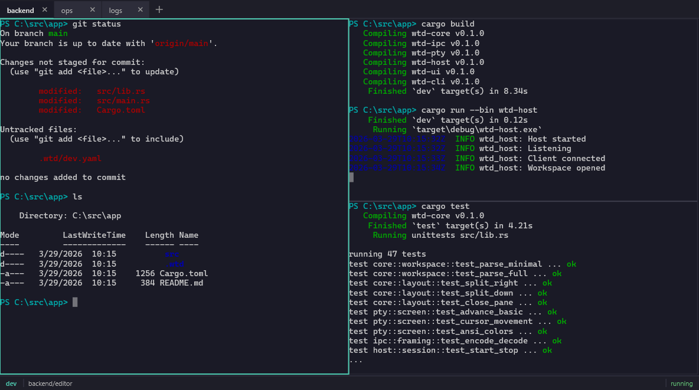
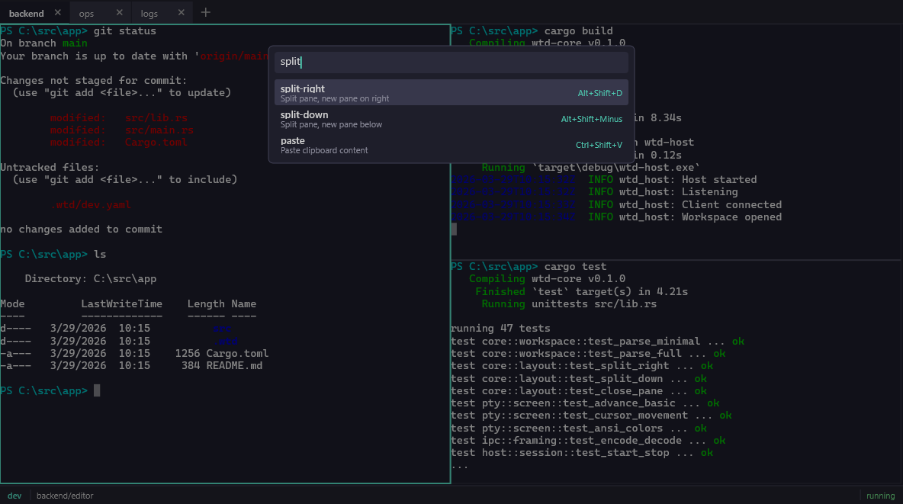
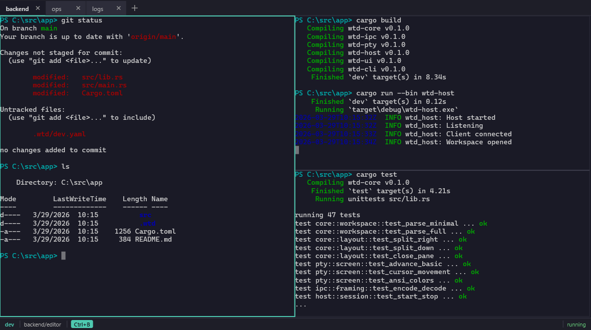
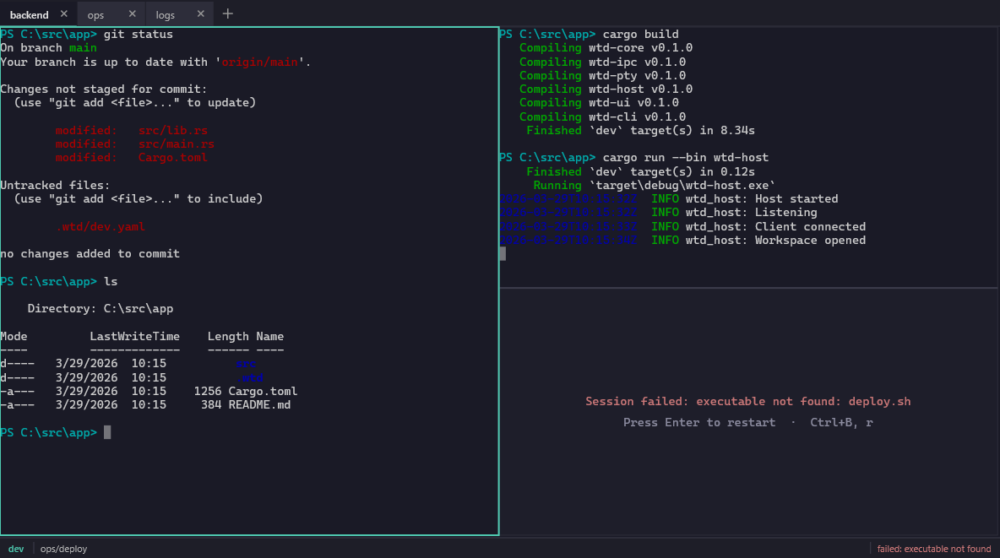

# WinTermDriver

<p align="center">
  
</p>

**WinTermDriver (WTD)** is a Windows-native terminal workspace manager for people
who want their terminal sessions to be both comfortable to use and easy to drive
from scripts, tools, and AI agents.

It gives you a real terminal UI with tabs, split panes, scrollback, command
palette actions, and Windows Terminal-style shortcuts. It also gives you a
controller plane: every pane has a semantic name, every workspace can be saved
and recreated, and the `wtd` CLI can send prompts, capture output, wait for
status changes, and coordinate long-running local workflows.



*A WTD workspace with tabs and split panes for git status, builds, and tests.*

## Why WTD Exists

Most terminals are excellent for humans and awkward for automation. Most
automation tools can run processes but do not give you a durable, inspectable,
interactive terminal workspace. WTD sits in the middle:

- You can use it like a normal terminal, with tabs, panes, profiles, focus
  movement, scrollback, copy/paste, and a command palette.
- You can define a project workspace once and recreate it consistently across
  machines or after a reboot.
- You can address panes by role, such as `dev/server`, `build/tests`, or
  `agents/reviewer`, instead of by window handle or process ID.
- You can drive a pane programmatically without losing the ability to look at it
  and intervene manually.
- Agent and supervisor workflows can wait on explicit status, attention, queue,
  and completion state instead of scraping terminal text forever.

In short: WTD is a terminal workspace that is meant to be operated by both a
person and a program.

## What You Get

| Area | What WTD provides |
|------|-------------------|
| Terminal UI | Native Windows window, Direct2D/DirectWrite rendering, tabs, split panes, pane focus, visible pane labels, retained scrollback, mouse and keyboard input |
| Workspace model | Human-editable YAML for tabs, panes, profiles, startup commands, keybindings, restart policy, and default settings |
| CLI control | `wtd start`, `send`, `prompt`, `capture`, `wait`, `inspect`, `action`, `save`, `recipe`, and host management commands |
| Agent hosting | Driver-aware prompt submission for Codex, Claude Code, Gemini CLI, Copilot CLI, and plain shells; status and notification hooks for hosted agent panes |
| Project workflows | Checked-in recipe manifests for reusable prompt/capture/wait/action sequences, with trust checks for changed workflow files |
| Windows integration | ConPTY-backed sessions, per-user named pipe IPC, PowerShell/cmd/WSL/SSH/custom profiles, Windows Terminal-style defaults |

## A Quick Tour

### Tabs, Panes, And Status

Workspaces can open with one pane, a small project layout, or a larger
dashboard. Panes keep stable names, and the top-right pane label shows the pane
role, distinct agent/window-title text, and useful activity indicators.

The status bar reports workspace save state, focused-pane status, prefix mode,
attention counts, and hover details where they help.

### Command Palette

Press `Ctrl+Shift+P` with the default Windows Terminal-style keybinding preset
to open the command palette. Fuzzy search filters the action catalog and shows
shortcut hints where actions have bindings.



### Prefix Chords

If you prefer tmux-style control, use the `tmux` keybinding preset. Prefix
chords such as `Ctrl+B` followed by `%`, `"`, `o`, or `c` handle split, focus,
and tab workflows, and the status bar shows when the prefix is active.



### Clear Failure States

When a session fails to launch or exits unexpectedly, the pane shows a readable
failure message and a restart hint instead of leaving you with a dead blank
pane.



## Scenarios

### 1. A Repeatable Project Workspace

Put `.wtd/dev.yaml` in a repository and define your everyday setup: editor
shell, server, test watcher, logs, database shell, SSH session, or anything else
that runs in a console. Start it with:

```powershell
wtd start dev
```

The host starts in the background, the UI opens, and every pane is reachable by
name.

### 2. A Human-Friendly Build Dashboard

Use panes for build, test, lint, and logs. Keep the UI open while scripts send
commands into the right panes:

```powershell
wtd send build/tests "cargo test --workspace"
wtd capture build/tests --lines 80
```

You keep the visual dashboard, while automation gets reliable capture and
targeting.

### 3. A Local Agent Control Room

Run agent CLIs in panes named by responsibility: `agents/codex`,
`agents/reviewer`, `agents/docs`, or `agents/pi`. Use `wtd ask` for the normal
agent loop: it sends the prompt through the pane's driver profile, waits for the
pane to become ready again, and captures the result.

```powershell
wtd ask agents/codex "Run the focused tests and summarize failures." --timeout 120 --lines 120
```

When you need the manual steps, use `wtd prompt`, `wtd wait`, then
`wtd capture`. `wtd wait` defaults to `ready`, which means the pane is no longer
working, has no pending queue, and has published a ready-style state such as
idle, done, or a completion marker.

### 4. A Shared Workflow Menu For A Repo

Project recipes let a repository expose reusable WTD workflows:

```powershell
wtd recipe list
wtd recipe show test-and-review
wtd recipe run test-and-review --dry-run
wtd recipe run test-and-review --var crate=wtd-cli
```

Recipes can prompt a pane, wait for an agent or command to finish, capture
recent output, and invoke actions. Changed checked-in recipe files are blocked
before execution unless you explicitly allow the changed workflow.

### 5. A Terminal You Can Inspect

WTD is useful for automation because panes expose more than plain text:

```powershell
wtd inspect dev/server --json
wtd capture dev/server --vt
wtd scrollback dev/server --tail 200
```

The host tracks screen state, title, cursor state, alternate screen state,
prompt driver configuration, process health, scrollback, and pane metadata.

## Getting Started

### Install From A Release

Download the latest `wtd-<version>-windows-x86_64.zip` from
[GitHub Releases](https://github.com/govert/WinTermDriver/releases). Extract it
somewhere stable and add that directory to your `PATH`.

The archive contains:

```text
wtd.exe          CLI controller
wtd-host.exe     Background host process
wtd-ui.exe       Graphical UI
```

Verify:

```powershell
wtd --version
wtd host status
```

The host normally auto-starts on first use, so `wtd host status` does not need
to be green before your first `wtd start`.

### Build From Source

Requirements:

- Windows 10 version 1809+ (build 17763+) for ConPTY
- Rust stable with the MSVC target

```powershell
git clone https://github.com/govert/WinTermDriver.git
cd WinTermDriver
cargo build --release
```

Add `target\release` to `PATH`, or copy `wtd.exe`, `wtd-host.exe`, and
`wtd-ui.exe` to a directory already on `PATH`.

### Start With No YAML

The fastest path is just:

```powershell
wtd
```

or:

```powershell
wtd start
```

That starts an ad-hoc default workspace and opens `wtd-ui`. You can add tabs and
panes interactively, rename the workspace, then save it to a YAML file later.

You can also start an ad-hoc workspace with a specific profile:

```powershell
wtd start --profile powershell
wtd start scratch --profile cmd
```

### Start With A Project Workspace

Create `.wtd/dev.yaml` in a repository:

```yaml
version: 1
name: dev
description: Local development workspace

tabs:
  - name: main
    layout:
      type: split
      orientation: horizontal
      ratio: 0.5
      children:
        - type: pane
          name: shell
          session:
            profile: powershell
        - type: pane
          name: server
          session:
            profile: powershell
            startupCommand: echo "server pane ready"
    focus: shell
```

Open it:

```powershell
wtd start dev
```

Then drive it:

```powershell
wtd list panes dev
wtd send dev/server "Get-Date"
wtd capture dev/server
wtd close dev --kill
```

## Everyday Use

### Launching And Saving

```powershell
wtd start dev                         # start or reuse dev and open the UI
wtd open dev                          # open/reuse without launching the UI
wtd-ui --workspace dev                # attach the UI separately
wtd save dev --file .wtd/dev.yaml     # save current layout
wtd rename-workspace dev local-dev    # rename a running workspace
wtd close dev                         # close the UI attachment
wtd close dev --kill                  # destroy the workspace instance
```

Workspace files are searched in this order:

1. Explicit `--file <path>`
2. `.wtd/<name>.yaml`, `.wtd/<name>.yml`, or `.wtd/<name>.json` under the
   current working directory
3. `%APPDATA%\WinTermDriver\workspaces\<name>.yaml`

Project-local definitions win over user-global definitions.

### Addressing Panes

Panes use semantic paths:

```text
pane-name
workspace/pane-name
workspace/tab-name/pane-name
```

Short forms are accepted when they are unambiguous. If two tabs have a pane with
the same name, use the full `workspace/tab/pane` form.

```powershell
wtd list panes dev
wtd focus dev/main/server
wtd rename dev/main/server api
wtd inspect dev/main/api
```

### Sending Input

Use `send` for low-level shell text:

```powershell
wtd send dev/server "npm run dev"
wtd send dev/server "echo no newline" --no-newline
wtd keys dev/server Ctrl+C
```

Use `prompt` for coding agents and prompt-driven TUIs:

```powershell
wtd configure-pane dev/agent --driver-profile codex
wtd prompt dev/agent "Explain the current failing tests and propose a fix."
```

`prompt` knows how to prepare, paste, soft-break, and submit according to the
pane's driver profile. That matters for multiline prompts and for agents whose
composer behavior is not the same as a shell.

### Reading Output

```powershell
wtd capture dev/server
wtd capture dev/server --lines 80
wtd capture dev/server --after "error:"
wtd capture dev/server --after-regex "FAILED|panic"
wtd capture dev/server --vt
wtd scrollback dev/server --tail 200
wtd follow dev/server
```

`capture --vt` returns a replayable terminal snapshot of the visible screen
state. Plain `capture` is better for quick human-readable text.

### Waiting And Notifications

Hosted agents or scripts can publish state:

```powershell
wtd status dev/tests --phase working --source codex "running tests"
wtd notify dev/tests --state needs-attention --source codex "review requested"
wtd notify dev/tests --state done --source codex "tests passed"
```

Coordinators can wait on it:

```powershell
wtd wait dev/tests --timeout 120
wtd wait dev/tests --for needs-attention --recent-lines 80
wtd wait dev/tests --for queue-empty --timeout 30
```

`wtd wait` is the preferred blocking primitive for agent coordination. It
returns current metadata and recent output on both success and timeout, so a
coordinator can often use `--recent-lines` instead of adding sleeps or an
immediate extra capture. Use `wtd capture` after the wait when you need the
exact visible terminal screen.

Concurrent CLI calls to a running host are supported. During host auto-start,
prefer one initial `wtd start`, `wtd list instances`, or other warm-up command
before launching multiple parallel waits; parallel first-use commands may race
while Windows is creating the per-user named pipe.

### Invoking UI Actions From The CLI

Most UI operations are actions, so they can be triggered from keyboard
shortcuts, the command palette, or the CLI:

```powershell
wtd action dev/server split-right profile=cmd
wtd action dev/server split-down profile=wsl
wtd action dev/server change-profile profile=powershell
wtd action dev/server restart-session
wtd action dev/server clear-buffer
```

## Workspace YAML Highlights

Workspace definitions are intentionally plain YAML. They can describe profiles,
defaults, keybindings, tabs, panes, startup commands, restart policy, and driver
defaults.

```yaml
version: 1
name: full-dev
description: Development, logs, and agent review

defaults:
  profile: pwsh
  restartPolicy: on-failure
  scrollbackLines: 20000
  driver:
    profile: codex

profiles:
  pwsh:
    type: powershell
    executable: pwsh.exe
    title: "{name} - PowerShell"
  ubuntu:
    type: wsl
    distribution: Ubuntu-24.04
  prodssh:
    type: ssh
    host: prod-box
    user: deploy
    port: 22
    identityFile: "%USERPROFILE%\\.ssh\\prod_key"

bindings:
  preset: windows-terminal
  keys:
    Ctrl+Shift+T: new-tab

tabs:
  - name: backend
    layout:
      type: split
      orientation: horizontal
      ratio: 0.55
      children:
        - type: pane
          name: server
          session:
            profile: pwsh
            cwd: "C:\\src\\app"
            startupCommand: dotnet watch run
        - type: split
          orientation: vertical
          ratio: 0.5
          children:
            - type: pane
              name: tests
              session:
                profile: pwsh
                cwd: "C:\\src\\app"
                startupCommand: cargo test --workspace
            - type: pane
              name: agent
              session:
                profile: pwsh
                cwd: "C:\\src\\app"
                driver:
                  profile: codex
    focus: server

  - name: ops
    layout:
      type: split
      orientation: vertical
      children:
        - type: pane
          name: prod-shell
          session:
            profile: prodssh
        - type: pane
          name: prod-logs
          session:
            profile: prodssh
            startupCommand: journalctl -f -u myservice
```

Built-in profile types:

| Type | Use |
|------|-----|
| `powershell` | Windows PowerShell or PowerShell Core |
| `cmd` | Command Prompt |
| `wsl` | A WSL distribution |
| `ssh` | Remote SSH session |
| `custom` | Any executable and argument list |

## Keybindings And UI Behavior

WTD ships with two major keybinding styles:

- `windows-terminal` is the default. It uses familiar shortcuts such as
  `Ctrl+Shift+P` for the command palette, `Ctrl+Shift+F` for find,
  `Ctrl+Shift+Up/Down/PageUp/PageDown/Home/End` for scrollback navigation, and
  `Ctrl+Shift+K` for `clear-buffer`.
- `tmux` uses `Ctrl+B` prefix chords for split, focus, tab, scrollback, search,
  and selection workflows.

Panes with retained scrollback show a thin scrollbar indicator. Hovering or
dragging expands it into a fuller scrollbar, with the thumb sized to the visible
portion of the buffer and clamped to a usable minimum.

The command palette exposes actions even when they do not have default
shortcuts, which makes it the easiest way to discover profile changes, retile
actions, workspace save, pane restart, scrollback actions, and pass-through
input.

For details, see
[Profile and keybinding discovery](docs/operations/PROFILE_AND_KEYBINDING_DISCOVERY.md)
and [Windows Terminal keybinding map](docs/WT_KEYBINDING_MAP.md).

## Project Recipes

Recipes are checked-in command sequences for WTD. They live in `.wtd/recipes.yaml`
or `wtd-recipes.yaml` and can be listed, inspected, dry-run, or executed.

```yaml
version: 1
commands:
  - name: test-and-review
    description: Run tests, wait for readiness, then capture output
    target:
      workspace: dev
      tab: backend
      pane: tests
    vars:
      crate: wtd-cli
    palette: true
    steps:
      - type: prompt
        text: cargo test -p {{crate}}
      - type: wait
        condition: ready
        timeout: 60
        recentLines: 80
      - type: capture
        lines: 80
      - type: prompt
        target: dev/backend/agent
        text: Review the latest test result and summarize risks.
```

Run:

```powershell
wtd recipe list
wtd recipe show test-and-review
wtd recipe run test-and-review --dry-run
wtd recipe run test-and-review --var crate=wtd-host
```

When a tracked recipe manifest has local changes, WTD blocks execution until you
review the diff and pass `--allow-changed-workflow`. Inspection and dry-runs do
not execute workflow steps and do not require confirmation.

See [Project recipes](docs/operations/PROJECT_RECIPES.md).

## Agent-Friendly Features

WTD does not require agents, but a lot of the design is useful when agents are
part of your local workflow.

### Driver-Aware Prompting

`wtd prompt` uses pane-local driver settings. Built-in CLI driver profiles:

| Profile | Submit key | Multiline behavior |
|---------|------------|--------------------|
| `plain` | `Enter` | Shell-style text; multiline rejected |
| `codex` | `Enter` | Terminal-style multiline paste, then submit |
| `claude-code` | `Enter` | `Shift+Enter` soft breaks |
| `gemini-cli` | `Enter` | `Shift+Enter` soft breaks |
| `copilot-cli` | `Enter` | `Shift+Enter` soft breaks |

Common flow:

```powershell
wtd ask agents/codex "Make the failing test pass, then explain the change." --timeout 180 --lines 120
```

### Status And Attention

Agent wrappers can publish structured state:

```powershell
tools/agent-hooks/wtd-agent-event.ps1 -Target agents/codex -Agent codex -Event working -Message "cargo test"
tools/agent-hooks/wtd-agent-event.ps1 -Target agents/codex -Agent codex -Event completed -Completion tests -Message "tests passed"
```

Events map onto `wtd status`, `wtd notify`, and `wtd wait`, so UI state and
automation state stay aligned.

See:

- [Agent guide](docs/AGENT_GUIDE.md)
- [Agent notification hooks](docs/operations/AGENT_NOTIFICATION_HOOKS.md)
- [Agent host compatibility](docs/AGENT_HOST_COMPATIBILITY.md)
- [Pi extension pattern](docs/operations/PI_WTD_EXTENSION_PATTERN.md)
- [tmux compatibility shim](docs/operations/TMUX_COMPATIBILITY.md)

## CLI Highlights

```text
wtd [start] [name] [--file path] [--recreate] [--profile name]
wtd open <name> [--file path] [--recreate]
wtd close <name> [--kill]
wtd save <name> [--file path]
wtd rename-workspace <name> <new-name>

wtd list workspaces
wtd list instances
wtd list panes <workspace>
wtd list sessions <workspace>

wtd send <target> <text> [--no-newline]
wtd prompt <target> <text>
wtd ask <target> <text> [--timeout seconds] [--lines N]
wtd keys <target> <key>...
wtd input <target> <data> [--escape|--hex|--base64]
wtd mouse <target> <kind> --col N --row N

wtd capture <target> [--lines N|--all|--after text|--after-regex pattern|--vt]
wtd scrollback <target> --tail N
wtd follow <target> [--raw]
wtd inspect <target>
wtd snapshot <workspace> [--file path]

wtd focus <target>
wtd rename <target> <new-name>
wtd action <target> <action> [key=value]...

wtd notify <target> [--state needs-attention|done|error|active] [--source name] [message]
wtd clear-attention <target>
wtd status <target> [--phase name] [--source name] [--queue-pending N] [--completion marker] [text]
wtd wait <target> [--for ready|needs-attention|error|idle|done|queue-empty|state-change]

wtd recipe list|show|run ...
wtd host status
wtd host stop
```

Most commands accept `--json` for machine-readable output and `--timeout <secs>`
for request timeout control.

## Architecture

WTD is split into three processes:

| Process | Role |
|---------|------|
| `wtd-host` | Per-user background process. Owns ConPTY sessions, screen buffers, workspace instances, process health, and the IPC server. Auto-starts on first CLI or UI connection. |
| `wtd-ui` | Native graphical terminal window. Renders tabs, panes, scrollback, command palette, status bar, and terminal content via Direct2D/DirectWrite. |
| `wtd` | Short-lived CLI controller. Sends requests to the host and prints human-readable or JSON results. |

They communicate over a per-user Windows named pipe
(`\\.\pipe\wtd-{SID}`) secured to the current user's SID.

### Crates

```text
crates/
  wtd-core/         Shared domain types, workspace definitions, layout tree, settings
  wtd-ipc/          IPC message types and named pipe framing
  wtd-pty/          ConPTY wrapper and VT screen buffer with scrollback
  wtd-host/         Host process, sessions, workspace instances, actions, IPC server
  wtd-ui/           UI process, renderer, input, tabs, panes, palette, status bar
  wtd-cli/          CLI controller that produces wtd.exe
  eval-renderer/    Renderer evaluation benchmarks
```

## Settings

User settings live in:

```text
%APPDATA%\WinTermDriver\settings.yaml
```

Example:

```yaml
defaultProfile: powershell
scrollbackLines: 10000
restartPolicy: never
font:
  family: "Cascadia Mono"
  size: 14.0
logLevel: info
copyOnSelect: false
confirmClose: true
```

Workspace-level profiles override global profiles with the same name. Resolution
order is:

1. Workspace profile
2. Global profile
3. Built-in default

## Building, Testing, And Diagnostics

Build everything:

```powershell
cargo build --workspace
cargo build --release --bin wtd-host --bin wtd-ui --bin wtd
```

Run tests:

```powershell
cargo test --workspace
```

Some integration tests spawn real Windows ConPTY sessions and must run on
Windows.

For resize, repaint, and mouse-capture investigations on the real Windows host
path:

```powershell
pwsh .\tools\Run-WtdCrosstermProbe.ps1 -AutoResize
```

The probe launches a deterministic terminal surface inside WTD, attaches
`wtd-ui`, captures visible buffers after startup and scripted resizes, and
writes logs under `logs\wtd-crossterm-probe\...`.

## Troubleshooting

### Connection Error Or Host Will Not Start

```powershell
wtd host status
```

If the host looks stale, check `%APPDATA%\WinTermDriver\host.pid`. The host
normally cleans this up on exit, but a crash can leave a stale PID file. Also
make sure `wtd-host.exe` is on `PATH` or next to `wtd.exe`; the CLI searches
next to itself first.

### Workspace Not Found

Check the workspace search order:

1. `--file <path>`
2. `.wtd/<name>.yaml`, `.wtd/<name>.yml`, or `.wtd/<name>.json`
3. `%APPDATA%\WinTermDriver\workspaces\<name>.yaml`

Use `wtd list workspaces` to see what WTD can discover.

### Target Not Found Or Ambiguous

List panes and use a more specific path:

```powershell
wtd list panes dev
wtd inspect dev/backend/server
```

Pane names can repeat on different tabs, so full paths are the most precise
form.

### Logs

Host logs are written to:

```text
%APPDATA%\WinTermDriver\wtd-host.log.*
```

Set `logLevel: debug` in `settings.yaml` or use the `WTD_LOG` environment
variable for more detail.

## Documentation Map

- [Agent guide](docs/AGENT_GUIDE.md): programmatic use from agents and scripts
- [Host control protocol](docs/protocol/WTD_HOST_CONTROL_PROTOCOL.md): IPC concepts and message surfaces
- [Project recipes](docs/operations/PROJECT_RECIPES.md): reusable repo-local workflows
- [Profile and keybinding discovery](docs/operations/PROFILE_AND_KEYBINDING_DISCOVERY.md): profiles, selectors, and shortcuts
- [Agent notification hooks](docs/operations/AGENT_NOTIFICATION_HOOKS.md): status and attention integration
- [Agent host compatibility](docs/AGENT_HOST_COMPATIBILITY.md): terminal compatibility for agent TUIs
- [Windows Terminal keybinding map](docs/WT_KEYBINDING_MAP.md): default keybinding comparison
- [Rendering decision record](docs/decisions/001-rendering-technology.md): why Direct2D/DirectWrite

## Project Status And Development

WTD is a Windows-first Rust project. It is built around real ConPTY sessions and
native rendering rather than a web terminal. The codebase is organized as a
Cargo workspace, with separate crates for core domain types, IPC, PTY/screen
state, host, UI, and CLI.

The project uses the [beads working method](docs/operations/BEADS_WORKING_METHOD.md)
for task tracking. Agent-specific workflow notes live in [AGENTS.md](AGENTS.md).

Contributions should keep the project biased toward:

- deterministic workspace recreation
- human-readable configuration
- reliable pane identity and semantic targeting
- strong Windows terminal behavior
- automation surfaces that are explicit and inspectable
- agent support that improves ordinary terminal use instead of replacing it

## License

[MIT](LICENSE.md)
